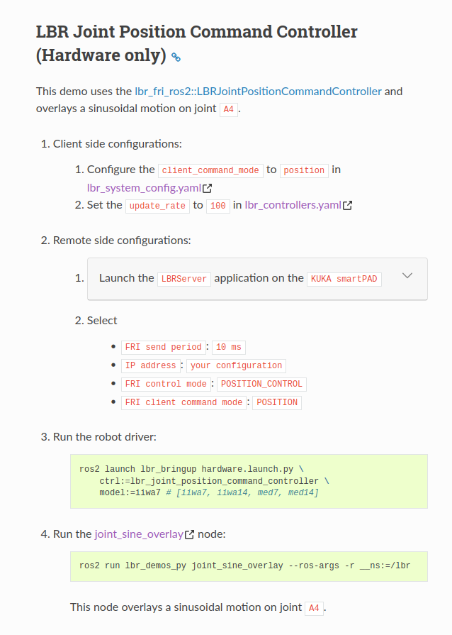

# Instructions

- **The Raspberry Pi (RPI) receives data:**  
  **Login:** `ubuntu@ubuntu`  
  **Command:**  
  ```bash
  ros2 multicast receive


- **The PC sends data:**  
**Login:** `rosuser@rosuser`  
**Command:**  
  ```bash
  ros2 multicast send
⸻


---

# 

---

# Run the Robot Driver
*Note: Run this in lbr_stack folder in ubuntu (ubuntu@ubuntu:~/lbr-stack$)*

``` os2 launch lbr_bringup hardware.launch.py \ ctrl:=lbr_joint_position_command_controller \ model:=iiwa14 ```

# Procedure

1. When you upload the Python script, press **AUT mode**.
2. Turn on the black keys with the controller.
3. Follow the instructions when the heartbeat signal appears.
4. Press the **green button** at the back until the options appear, then release the button.
5. **Do not** press both the green and grey buttons together — it's in **T1 mode**, so automatic operation is easier.

---

# Run the `joint_sine_overlay` node
*Note: Run this in ros_ws in pc so rosuser (rosuser@rosuser:~/ros2_ws$)*

``` ros2 run lbr_demos_py joint_sine_overlay --ros-args -r __ns:=/lbr ```

